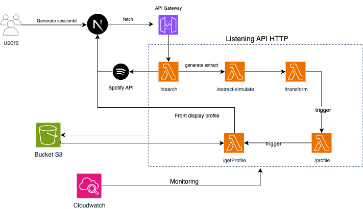

# 🎧 Listening Intelligence – Data Profile Generator

Un projet full serverless AWS qui permet d’analyser les préférences musicales à partir d’une sélection d’artistes simulés, et de générer un profil enrichi automatiquement.

⚠️ Note importante : en raison de nouvelles restrictions imposées par Spotify, la version connectée (OAuth) n’est plus accessible au public.
Seul le mode simulation (sans compte Spotify) est disponible actuellement.

📌 Pourquoi cette limitation avec Spotify ?
Spotify a récemment renforcé les critères de validation pour l’accès aux données utilisateurs (écoutes récentes, audio features, etc.).
Les applications non vérifiées par Spotify ne peuvent plus utiliser l’authentification OAuth en production publique, sauf à inscrire manuellement chaque testeur dans le dashboard développeur.

👉 C’est pourquoi la version actuellement en ligne est 100 % simulée — mais suit le même pipeline de traitement que la version connectée.

---

## 📸 Aperçu de l'architecture



---

## 🧠 Fonctionnalités clés

- ✅ Recherche intelligente d’artistes via Spotify API
- 🪄 Extraction & enrichissement des morceaux top tracks (audio features)
- 🔁 Pipeline ETL orchestré via fonctions AWS Lambda
- 📂 Stockage et versioning des données via Amazon S3
- 🔍 Analyse de genres, émotions dominantes, énergie, dansabilité
- 📊 Génération automatique de profils musicaux personnalisés
- 🔒 Aucune authentification requise (mode simulation userless)

---

## ⚙️ Architecture Technique

- **Frontend** : Next.js + Tailwind (mobile-first)
- **API Gateway HTTP** : unique point d’entrée vers les lambdas
- **Lambdas** :
  - `/search` → recherche d'artistes
  - `/extract-simulate` → top tracks + audio features
  - `/transform` → enrichissement et nettoyage
  - `/profile` → génération du profil résumé
  - `/getProfile` → accessible par le frontend
- **Storage** : Amazon S3 (dossiers par session)
- **Monitoring** : AWS CloudWatch
- **CI/CD (prévu)** : GitHub Actions + tests unitaires sur les lambdas

---

## 🧩 Fonctionnement détaillé des services AWS

| Service         | Rôle                                                                 |
|----------------|----------------------------------------------------------------------|
| **AWS Lambda** | Exécute chaque étape du pipeline ETL (search, extract, transform, etc.) |
| **API Gateway**| Point d’entrée HTTP exposant toutes les routes frontend ↔ backend, CORS   |
| **Amazon S3**  | Stockage structuré par session des données extraites, enrichies et du profil |
| **CloudWatch** | Monitoring (logs, erreurs, suivi) des lambdas                        |
| **IAM**        | Gestion fine des permissions par fonction                            |
| **TTL S3**     | Politique d’expiration automatique des données après 24h (gestion coût + confidentialité) |
| **IAM Role**     | Gestion fine des permissions par fonction |
| **Amazon ECR**     | Conteneurisation Docker des fonctions Lambda |
	
	

- Chaque appel frontend contient un `sessionId` dans le body, utilisé pour isoler les fichiers stockés et les analyser séparément.
- Le projet est compatible avec le Free Tier AWS.


---

## 🛠️ Tech Stack

| Catégorie      | Stack                      |
|----------------|----------------------------|
| Frontend       | `Next.js`, `Tailwind`      |
| Backend        | `AWS Lambda`, `API Gateway`|
| API externe    | `Spotify Web API`          |
| Stockage       | `Amazon S3`                |
| Monitoring     | `CloudWatch`               |
| CI/CD          | `GitHub Actions` *(à venir)* |

---

## 🔍 Exemple de profil généré

```json
{
  "session_id": "abc123",
  "genres": ["rap français", "drill", "trap"],
  "dominant_emotion": "énergie brute",
  "energy_avg": 0.83,
  "danceability_avg": 0.76,
  "top_emotions": ["énergie", "confiance", "tension"]
}
```

---

## illustration


---

## ✍️ Pourquoi ce projet ?

> Ce projet m’a permis de maîtriser :
> - L’**architecture serverless sur AWS**
> - L’usage **pratique d’API externes dans un pipeline** ETL
> - Le déploiement propre d’un backend cloud **multi-Lambda orchestré**
> - La **génération dynamique de profils utilisateur simulés**

---

## 🚀 Déploiement

**Stack AWS gratuite (Free Tier compatible)**  
- 100 % sans backend persisté (NoSQL ou RDS)
- Déclencheurs S3 / API Gateway HTTP
- CI/CD à venir avec Docker pour tests Lambda

---

## 📁 Arborescence technique

```
├── frontend/              # Next.js app
├── lambdas/               # Code des fonctions Lambda
│   ├── search/
│   ├── extract-simulate/
│   ├── transform/
│   ├── profile/
│   └── getProfile/
└── README.md
```

---

## 📌 Crédits

- 🧠 Idée originale et architecture : [@kitana](https://www.instagram.com/kitana.ht/)
- 🛠️ Développement, backend cloud AWS et frontend : [@Jeff-Erson44](https://github.com/Jeff-Erson44)

---
